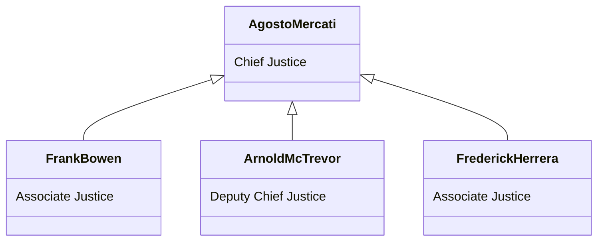
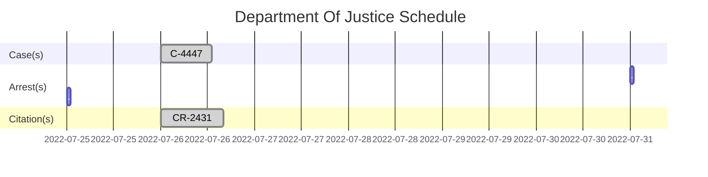

<h3 align="center">The State of San Andreas Administration</h3>

<h3>🔰County(s)</h3> 
  
  [`TSDOJ`](https://github.com/NotKaarlo/FivePD-Reports/tree/main/TSDOJ)

  <h3>Members Of San Andreas Supreme Court</h3>

### Department Of Justice Log
#### ~~`#444778496112091`~~[^1]. `Closed`
#### ~~`#243142782492362`~~[^2]. `Closed`

[^1]: This Case is closed and is now concluded by Department Of Justice.  
  (Sign by **Deputy Chief Justice - Arnold McTrevor**).  
  Closed At `2022-07-26 | 18:26`  
  (More Details About the Case At([#243142782492362](https://notkaarlo.github.io/State-of-San-Andreas/TSDOJ/Case%23444778496112091))   
[^2]:  Has been paid by the defendant.   
  (Sign by **Deputy Chief Justice - Arnold McTrevor**)  
  Citation Paid At `2022-07-26 | 17:55`        
  **`Violation(s):`**      
  #`Unlawful Speed Over 10-14 Over`,   
  #`Unsafe Operation on Road/Highway`,  
  #`Too Fast for Conditions`,  
  #`Careless Driving`  
  Paid fine of `$700`  
  (More Details About the Report At([#444778496112091](https://notkaarlo.github.io/State-of-San-Andreas/TSDOJ/CR%23243142782492362))    
