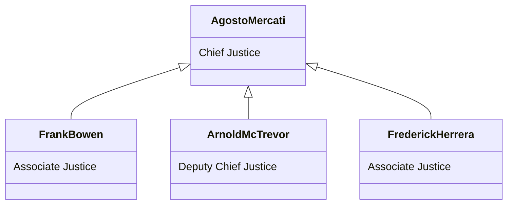

<div align="center">

</div>

<h3 align="center">The State of San Andreas Administration</h3>

#

### 🔰County(s) 
  
  [`TSDOJ`](https://github.com/NotKaarlo/FivePD-Reports/tree/main/TSDOJ)

#

<div align="center">

</div>

<div align="center">
  <h3>Members Of San Andreas Supreme Court</h3>


</div>


```mermaid
gantt
dateFormat  YYYY-MM-DD
title Department Of Justice Schedule
excludes weekdays 2022-07-26

section Cases
Case8574        :done,                 2022-07-26,26h
Case0957        :                      2022-08-10, 5d
Case2352        :                      10h,30h

section Reports
Report3514             :active,       2022-07-26,40h
Report2683             :              2022-07-27,1d            
```
  
##

### Department Of Justice Log
#### ~~`#444778496112091`~~[^1]. `Closed`
#### ~~`#243142782492362`~~[^2]. `Closed`

[^1]: This Case is closed and is now concluded by Department Of Justice.  
  (Case info at @TSDOJ) (Sign by Douglas James Washington).  
  Closed At `2022-07-26` `18:26`    
[^2]:  Has been paid by the defendant, Fine of `$700`  
  (More info at @TSDOJ) (Sign by Arnold McTrevor)  
  Citation Paid At `2022-07-26` `17:55`  
