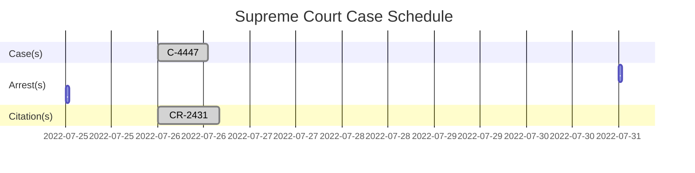

<div align="center">
   
</div> 

<h2 align="center">The San Andreas State Government</h3>

<div align="center">

</div>

### Supreme Court of San Andreas
- #### Judicial Positional Structure
   - *Chief Justice* Bill Hunter
     - *Justice* Dave Jackson
     - *Justice* Bryson Legge
     - *Justice* Maria Simpson
     - *Justice* Santiago Whitworth

<div align="center">


   <h2>Supreme Court Judgement</h3>
</div>

## `#243142782492362` `Concluded`
```diff
+ #243142782492362 Verdict (#Department: Los Santos Police Department)(County: TSDOJ)
────────────────────────
! After throughout review of the case "243142782492362" the Supreme Court has come to a verdict!
- That the victim Darrel Sampson was killed in a unusual car accident. And no man i is liable for the death of Darrel Sampson
────────────────────────
Ordered by Judge Santiago Whitworth, This court is now dismissed. Concluded at 2022-07-26 18:26
```

###### [`#243142782492362`](https://notkaarlo.github.io/State-of-San-Andreas/TSDOJ/A%23444778496112091)
---

## `#444778496112091` `Concluded`
```diff
+ #444778496112091 Fine (#Department: Blaine County Sheriff's Officer)(County: TSDOJ)
────────────────────────
! After throughout review of the case "#444778496112091" the Supreme Court has come to a verdict!
- This Citation has been paid by Lacey Webb so the case has been closed. A fine of $700 was paid.
────────────────────────
- Violation(s) 
Unlawful Speed Over 10-14 Over, 
Unsafe Operation on Road/Highway, 
Too Fast for Conditions, 
Careless Driving
────────────────────────
Ordered by Judge Santiago Whitworth, This court is now dismissed. Concluded at 2022-07-24 17:55
```

###### [`#444778496112091`](https://notkaarlo.github.io/State-of-San-Andreas/TSDOJ/A%#444778496112091)

---

<div align=center>

</div>



<h3>🔰County(s)</h3> 

 [`TSDOJ`](https://github.com/NotKaarlo/FivePD-Reports/tree/main/TSDOJ)

<div align="right">
    
</div> 
