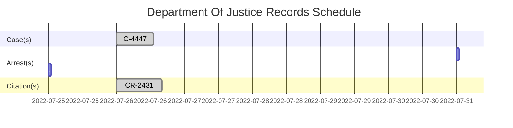

   

 

<h2 align="center">The San Andreas State Government</h3>

### Judiciary of San Andreas
- ##### Judicial Positional Structure
   - **Office of the Chief Justice**
     - *Chief Justice*
       - Agosto Mercati
     - *Deputy Chief Justice*
       - Arnold McTrevor
     - *Associate Justice*
       - Frederick Herrera
       - Frank Bowen

<!--##### The Courts of San Andreas-->

<!--##### Judicial Positional Structure-->

<h3>Members Of San Andreas Supreme Court</h3>

--- 

### `Department Of Justice Records`
  | `ID`               | `Status`        | `Closed At`          | `Type`     | `Sign By`                              |  
  |--------------------|-----------------|----------------------|------------|----------------------------------------|  
  | [`#243142782492362`](https://notkaarlo.github.io/State-of-San-Andreas/TSDOJ/Case%23444778496112091) | `Concluded`     | `2022-07-26 / 18:26`  | `Case`     | `Deputy Chief Justice Arnold McTrevor` |  
  | [`#444778496112091`](https://notkaarlo.github.io/State-of-San-Andreas/TSDOJ/CR%23243142782492362) | `Paid & Closed` | `2022-07-26 / 17:55` | `Citation` | `Deputy Chief Justice Arnold McTrevor` |  

<h3>🔰County(s)</h3> 

####  [`TSDOJ`](https://github.com/NotKaarlo/FivePD-Reports/tree/main/TSDOJ)

